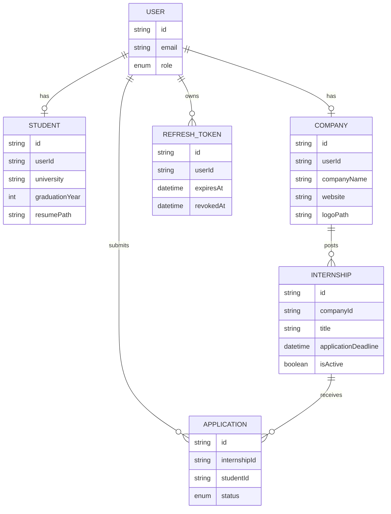

# Database ER Diagram

```mermaid
erDiagram
  USER ||--o| STUDENT : has
  USER ||--o| COMPANY : has
  COMPANY ||--o{ INTERNSHIP : posts
  USER ||--o{ APPLICATION : submits
  INTERNSHIP ||--o{ APPLICATION : receives
  USER ||--o{ REFRESH_TOKEN : owns

  USER { string id string email enum role }
  STUDENT { string id string userId string university int graduationYear string resumePath }
  COMPANY { string id string userId string companyName string website string logoPath }
  INTERNSHIP { string id string companyId string title datetime applicationDeadline boolean isActive }
  APPLICATION { string id string internshipId string studentId enum status }
  REFRESH_TOKEN { string id string userId datetime expiresAt datetime revokedAt }
```
